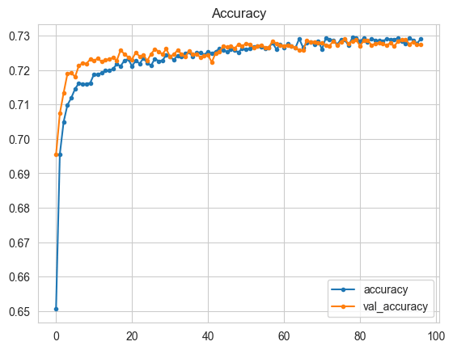
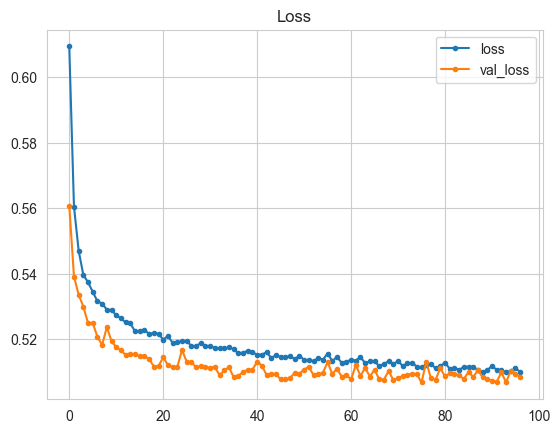
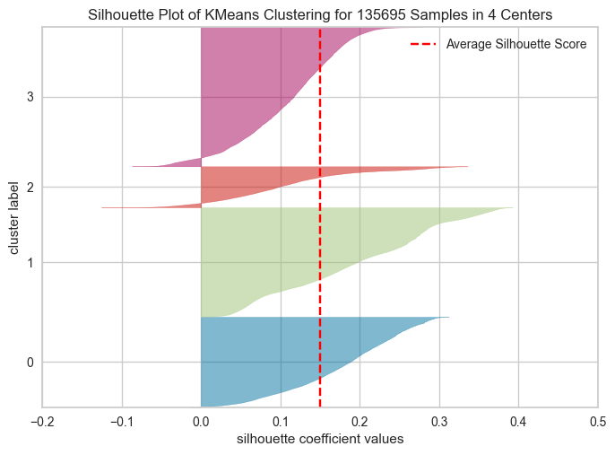
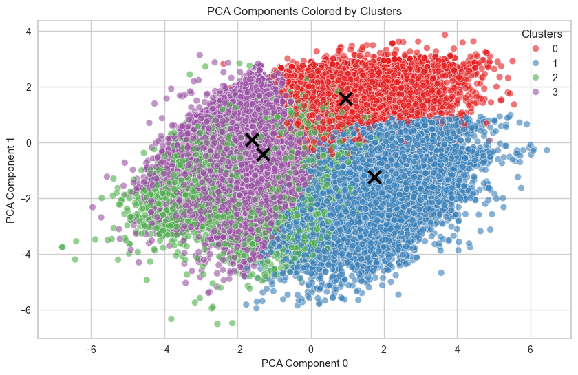
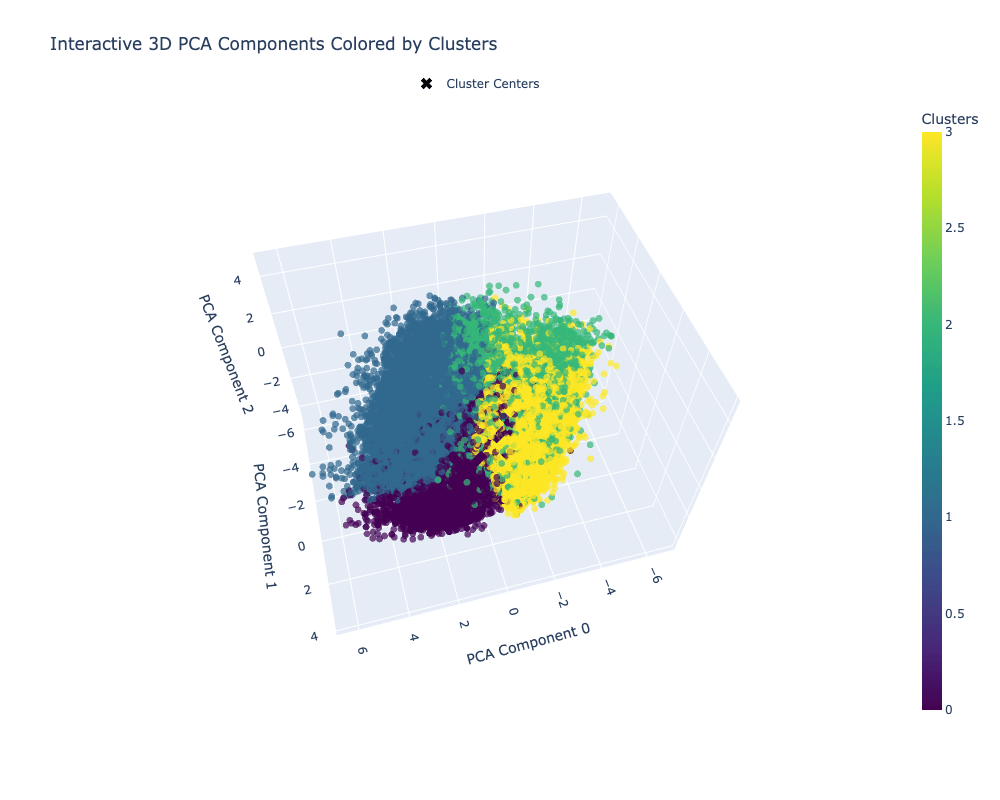
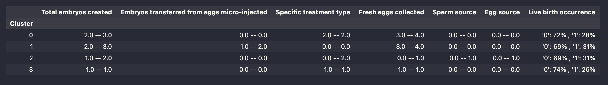

# IVF Success Predictor

This project was developed to create a machine learning model that predicts the success of IVF (In Vitro Fertilization) treatments based on historical patient data. With infertility affecting millions worldwide, the need for personalized and accurate treatment predictions is addressed through data-driven insights. The project aims to assist Hope Fertility Clinic in enhancing treatment success rates, optimizing patient care, and providing tailored recommendations.

A comprehensive analysis of IVF treatment data was conducted to explore key factors influencing outcomes. A classification model was built to predict the likelihood of successful treatments. Additionally, detailed data visualizations and an interactive dashboard were created to provide clinicians with valuable insights, enabling informed decision-making in real-time.

The project’s ultimate goal is to provide healthcare professionals with a robust tool that not only predicts treatment outcomes but also helps refine treatment strategies, improve patient satisfaction, and maximize success rates.

**Note:**
I had to restart a new repo without history due to the size of the original repo so I could deploy the project. To refer to the commit history, please go to my [original repo](https://github.com/pswhdev/ivf-success-predictor)

The deployed project can be accessed [here](https://ivf-predictor-2a5c65ec6df4.herokuapp.com/)

## Table of contents

- [IVF Success Predictor](#ivf-success-predictor)
  - [Table of contents](#table-of-contents)
  - [Dataset Content](#dataset-content)
  - [Project Terms \& Jargon](#project-terms--jargon)
  - [Business Requirements](#business-requirements)
  - [Hypotheses and Validation Methods](#hypotheses-and-validation-methods)
  - [The rationale to map the business requirements to the Data Visualizations and ML tasks](#the-rationale-to-map-the-business-requirements-to-the-data-visualizations-and-ml-tasks)
  - [ML Business Case](#ml-business-case)
    - [Predicting IVF Treatment Success](#predicting-ivf-treatment-success)
      - [Classification Model](#classification-model)
  - [Dashboard Design](#dashboard-design)
    - [Page 1: Quick Project Summary](#page-1-quick-project-summary)
    - [Page 2: Exploratory Analysis of IVF Treatment Data Page](#page-2-exploratory-analysis-of-ivf-treatment-data-page)
    - [Page 3: Project Hypothesis and Validation](#page-3-project-hypothesis-and-validation)
    - [Page 4: IVF Success Predictor](#page-4-ivf-success-predictor)
    - [Page 5: ML Success Predictor](#page-5-ml-success-predictor)
  - [Unfixed Bugs](#unfixed-bugs)
  - [The Dataset and the Models](#the-dataset-and-the-models)
  - [Conclusions](#conclusions)
  - [Deployment](#deployment)
    - [Heroku](#heroku)
  - [Main Data Analysis and Machine Learning Libraries](#main-data-analysis-and-machine-learning-libraries)
  - [Credits](#credits)
  - [Acknowledgements](#acknowledgements)

## Dataset Content

The dataset was retrieved from the [Human Fertilization and Emblriology Authority - HFEA website](https://www.hfea.gov.uk/about-us/data-research/).

The dataset includes information collected during fertility treatment cycles about patient and partner characteristics, treatment details, infertility causes, and outcomes related to pregnancy and live births.

The variables are summarized on the table below, where each row represents a specific variable relevant to fertility treatment cycles and the type of data and Description according to the [HEFA's Guide to anonymised register](https://www.hfea.gov.uk/media/2682/guide-to-the-anonymised-register.pdf).

| Field                                             | Data Type | Description                                                                                                                                                                                                                                                                                                                       |
| ------------------------------------------------- | --------- | --------------------------------------------------------------------------------------------------------------------------------------------------------------------------------------------------------------------------------------------------------------------------------------------------------------------------------- |
| Patient Age at Treatment                          | Text      | Patient’s age at treatment, banded as follows: 18-34, 35-37, 38-39, 40-42, 43-44, 45-50                                                                                                                                                                                                                                           |
| Total Number of Previous IVF Cycles               | Number    | How many treatment cycles of IVF the patient has previously had                                                                                                                                                                                                                                                                   |
| Total Number of Previous DI Cycles                | Number    | How many treatment cycles of DI the patient has previously had                                                                                                                                                                                                                                                                    |
| Total Number of Previous Pregnancies - IVF and DI | Number    | How many times the patient has previously been pregnant through IVF and DI                                                                                                                                                                                                                                                        |
| Total Number of Previous Live Births - IVF or DI  | Number    | How many live births the patient has had through IVF or DI                                                                                                                                                                                                                                                                        |
| Causes of Infertility - Tubal Disease             | Bit       | 1 if the primary cause of infertility is as detailed, 0 otherwise                                                                                                                                                                                                                                                                 |
| Causes of Infertility - Ovulatory Disorder        | Bit       | 1 if the primary cause of infertility is as detailed, 0 otherwise                                                                                                                                                                                                                                                                 |
| Causes of Infertility - Male Factor               | Bit       | 1 if the primary cause of infertility is as detailed, 0 otherwise                                                                                                                                                                                                                                                                 |
| Causes of Infertility - Patient Unexplained       | Bit       | 1 if the primary cause of infertility is as detailed, 0 otherwise                                                                                                                                                                                                                                                                 |
| Causes of Infertility - Endometriosis             | Bit       | 1 if the primary cause of infertility is as detailed, 0 otherwise                                                                                                                                                                                                                                                                 |
| Main Reason for Producing Embryos Storing Eggs    | Text      | A comma separated list of the main reasons for this cycle which can include: Treatment Now, For Donation, For Storing Eggs, For Research                                                                                                                                                                                          |
| Stimulation Used                                  | Bit       | 1 if this was a stimulated cycle, 0 otherwise                                                                                                                                                                                                                                                                                     |
| Egg Donor Age at Registration                     | Text      | If donor eggs were used, the donor's age at registration banded as follows: <=20, 21-25, 26-30, 31-35                                                                                                                                                                                                                             |
| Sperm Donor Age at Registration                   | Text      | If donor sperm was used, the donor's age at registration banded as follows: <=20, 21-25, 26-30, 31-35, 36-40, 41-45, >45                                                                                                                                                                                                          |
| Donated Embryo                                    | Bit       | 1 if this cycle used a donated embryo, 0 otherwise                                                                                                                                                                                                                                                                                |
| Type of Treatment - IVF or DI                     | Text      | IVF or DI                                                                                                                                                                                                                                                                                                                         |
| Specific Treatment Type                           | Text      | A comma separated list of specific treatment types used in this cycle                                                                                                                                                                                                                                                             |
| PGT-M Treatment                                   | Bit       | 1 if this cycle involved the use of preimplantation genetic testing for monogenic disorders (formerly PGD), 0 otherwise                                                                                                                                                                                                           |
| PGT-A Treatment                                   | Bit       | 1 if this cycle involved the use of preimplantation genetic testing for aneuploidy (formerly PGS), 0 otherwise                                                                                                                                                                                                                    |
| Elective Single Embryo Transfer                   | Bit       | 1 if this cycle involved the deliberate use of only one embryo, 0 otherwise                                                                                                                                                                                                                                                       |
| Egg Source                                        | Text      | Indicates whether the eggs used in this cycle came from the patient (P) or a donor (D)                                                                                                                                                                                                                                            |
| Sperm Source                                      | Text      | Indicates whether the sperm used in this cycle came from the patient (P) or a donor (D)                                                                                                                                                                                                                                           |
| Fresh Cycle                                       | Bit       | 1 if this cycle used fresh embryos, 0 otherwise                                                                                                                                                                                                                                                                                   |
| Frozen Cycle                                      | Bit       | 1 if this cycle used frozen embryos, 0 otherwise                                                                                                                                                                                                                                                                                  |
| Eggs Thawed (0/1)                                 | Number    | If this cycle used frozen eggs, the number of eggs thawed                                                                                                                                                                                                                                                                         |
| Fresh Eggs Collected                              | Text      | Number of eggs collected in this cycle, banded into 5 categories for identifiability                                                                                                                                                                                                                                              |
| Fresh Eggs Stored (0/1)                           | Number    | The number of eggs collected in this cycle and subsequently frozen                                                                                                                                                                                                                                                                |
| Total Eggs Mixed                                  | Text      | Number of eggs mixed with sperm in this cycle, banded into 5 categories for identifiability                                                                                                                                                                                                                                       |
| Total Embryos Created                             | Text      | Number of embryos created in this cycle, banded into 5 categories for identifiability                                                                                                                                                                                                                                             |
| Embryos Transferred                               | Number    | The number of embryos transferred into the patient in this cycle                                                                                                                                                                                                                                                                  |
| Total Embryos Thawed                              | Text      | Number of embryos thawed in this cycle, banded into 5 categories for identifiability                                                                                                                                                                                                                                              |
| Embryos Transferred from Eggs Micro-injected      | Number    | The number of embryos transferred into the patient in this cycle that were created using ICSI                                                                                                                                                                                                                                     |
| Embryos Stored for Use by Patient                 | Text      | Number of embryos created and stored for future use by the patient, banded into 5 categories for identifiability                                                                                                                                                                                                                  |
| Date of Embryo Transfer                           | Number    | The number of days between embryo transfer and the first date provided in the series: egg collection date; egg thaw date; egg mix date; embryo thaw date; embryo transfer date                                                                                                                                                    |
| Year of Treatment                                 | Number    | The year in which this cycle took place                                                                                                                                                                                                                                                                                           |
| Live Birth Occurrence                             | Bit       | 1 if there were 1 or more live births as a result of this cycle, 0 otherwise                                                                                                                                                                                                                                                      |
| Number of Live Births                             | Number    | The number of live births as a result of this cycle                                                                                                                                                                                                                                                                               |
| Early Outcome                                     | Text      | A comma separated list of the results of a patient scan                                                                                                                                                                                                                                                                           |
| Number of Foetal Sacs with Fetal Pulsation        | Number    | If foetal sacs were present in the scan, the number of sacs that evidenced foetal pulsation                                                                                                                                                                                                                                       |
| Heart One Weeks Gestation                         | Number    | The number of weeks of gestation for this foetal heart: banded for less than 30 weeks or greater than 40 weeks                                                                                                                                                                                                                    |
| Heart One Birth Outcome                           | Text      | Comma separated list of the outcome of this pregnancy: Embryo reduction; live birth; miscarriage; still birth; termination                                                                                                                                                                                                        |
| Heart One Birth Weight                            | Text      | Banded birthweight of this child: Less than 1kg; Between 1.5kg and 1.99Kg; Between 1kg and 1.49Kg; Between 2.0kg and 2.49Kg; Between 2.5kg and 2.99Kg; Between 3.0kg and 3.49Kg; Between 3.5kg and 3.99Kg; Between 4.0kg and 4.49Kg; Between 4.5kg and 4.99Kg; Between 5.0kg and 5.49Kg; Between 5.5kg and 5.99Kg; 6kg or greater |
| Heart One Sex                                     | Text      | The sex of the child: Male (M), Female (F)                                                                                                                                                                                                                                                                                        |
| Heart One Delivery Date                           | Number    | Year the child was delivered                                                                                                                                                                                                                                                                                                      |
| Heart One Birth Congenital Abnormalities          | Bit       | 1 if a congenital abnormality was recorded, 0 otherwise                                                                                                                                                                                                                                                                           |
| Heart Two Weeks Gestation                         | Number    | The number of weeks of gestation for this foetal heart: banded for less than 30 weeks or greater than 40 weeks                                                                                                                                                                                                                    |
| Heart Two Birth Outcome                           | Text      | Comma separated list of the outcome of this pregnancy: Embryo reduction; live birth; miscarriage; still birth; termination                                                                                                                                                                                                        |
| Heart Two Birth Weight                            | Text      | Banded birthweight of this child: Less than 1kg; Between 1.5kg and 1.99Kg; Between 1kg and 1.49Kg; Between 2.0kg and 2.49Kg; Between 2.5kg and 2.99Kg; Between 3.0kg and 3.49Kg; Between 3.5kg and 3.99Kg; Between 4.0kg and 4.49Kg; Between 4.5kg and 4.99Kg; Between 5.0kg and 5.49Kg; Between 5.5kg and 5.99Kg; 6kg or greater |
| Heart Two Sex                                     | Text      | The sex of the child: Male (M), Female (F)                                                                                                                                                                                                                                                                                        |
| Heart Two Delivery Date                           | Number    | Year the child was delivered                                                                                                                                                                                                                                                                                                      |
| Heart Two Birth Congenital Abnormalities          | Bit       | 1 if a congenital abnormality was recorded, 0 otherwise                                                                                                                                                                                                                                                                           |
| Heart Three Weeks Gestation                       | Number    | The number of weeks of gestation for this foetal heart: banded for less than 30 weeks or greater than 40 weeks                                                                                                                                                                                                                    |
| Heart Three Birth Outcome                         | Text      | Comma separated list of the outcome of this pregnancy: Embryo reduction; live birth; miscarriage; still birth; termination                                                                                                                                                                                                        |
| Heart Three Birth Weight                          | Text      | Banded birthweight of this child: Less than 1kg; Between 1.5kg and 1.99Kg; Between 1kg and 1.49Kg; Between 2.0kg and 2.49Kg; Between 2.5kg and 2.99Kg; Between 3.0kg and 3.49Kg; Between 3.5kg and 3.99Kg; Between 4.0kg and 4.49Kg; Between 4.5kg and 4.99Kg; Between 5.0kg and 5.49Kg; Between 5.5kg and 5.99Kg; 6kg or greater |
| Heart Three Sex                                   | Text      | The sex of the child: Male (M), Female (F)                                                                                                                                                                                                                                                                                        |
| Heart Three Delivery Date                         | Number    | Year the child was delivered                                                                                                                                                                                                                                                                                                      |
| Heart Three Birth Congenital Abnormalities        | Bit       | 1 if a congenital abnormality was recorded, 0 otherwise                                                                                                                                                                                                                                                                           |
| Patient Ethnicity                                 | Text      | Information on patient ethnicity has been included                                                                                                                                                                                                                                                                                |
| Partner Ethnicity                                 | Text      | Information on partner ethnicity has been included                                                                                                                                                                                                                                                                                |
| Partner Type                                      | Text      | Information on partner types has been included (i.e., Male partner, female partner, no partner, surrogate)                                                                                                                                                                                                                        |
| Partner Age                                       | Text      | Banded partner age information has been added where available                                                                                                                                                                                                                                                                     |

---

## Project Terms & Jargon

- **IVF(In Vitro Fertilization)** is a medical procedure where an egg is fertilized by sperm outside the body, with the resulting embryo being implanted into the uterus.
- **Embryo** is the early developmental stage formed after an egg is fertilized by sperm, before implantation in the uterus.
- A **patient** is an individual undergoing IVF fertility treatment.
- **Number of Previous IVF/DI Cycles**: The total number of IVF or donor insemination cycles the patient has previously undergone.
- **Elective Single Embryo Transfer (eSET)** is a process where only one embryo is selected for transfer to reduce the risk of multiple pregnancies.
- **Specific Treatment Type** is the exact fertility treatment protocol used, such as ICSI (Intracytoplasmic Sperm Injection), FET (Frozen Embryo Transfer), or standard IVF.
- **Ovarian Stimulation** is a process where medication is used to induce the ovaries to produce multiple eggs in a single cycle.
- **Fresh vs. Frozen Cycle**: A fresh cycle refers to the use of embryos from the current stimulation cycle, while a frozen cycle uses embryos that were frozen from a previous cycle.
- **PGT-M and PGT-A (Preimplantation Genetic Testing)**: Genetic tests performed on embryos to identify genetic abnormalities before transfer. PGT-M is for monogenic disorders, and PGT-A is for aneuploidy (chromosome abnormalities).
- **Endometriosis** is a condition where tissue similar to the lining of the uterus grows outside the uterus, potentially affecting fertility.
- **Sperm Quality** are attributes of sperm, including count, motility, and morphology, that affect the likelihood of successful fertilization.
- **Live Birth Occurrence** is the successful delivery of a living baby following an IVF cycle.

---

## Business Requirements

Dr. Emily Davis, chief fertility specialist at Hope Fertility Clinic, has observed varying IVF success rates among patients due to numerous factors. She aims to identify key predictors of IVF success to optimize treatment plans and improve patient outcomes. Dr. Davis seeks to understand how patient attributes and treatment variables correlate with IVF success, focusing on the most impactful factors.

She is particularly interested in:

- **Predicting success rates for new patients based on their profiles, using a predictive model for more accurate estimations and personalized treatments**.

To support her team, Dr. Davis requests

- **Detailed data visualizations to illustrate key variable relationships and an interactive dashboard for exploring data and making real-time predictions**.

---

## Hypotheses and Validation Methods

1. Patient age has a direct impact on the success rate of IVF treatments.

2. Elective single embryo transfer (eSET) reduces the likelihood of multiple pregnancies without significantly lowering the overall success rate.

3. Patients with a history of endometriosis have lower IVF success rates compared to those without endometriosis.

4. The age of the semen provider does not influence the success rate of IVF treatments.

All hypotheses will be investigated using correlation studies and graphical evaluation.

## The rationale to map the business requirements to the Data Visualizations and ML tasks

- **Business Requirement 1**: Classification and Data Analysis

  - A binary classifier will be developed to predict the success of IVF treatments.

- **Business Requirement 2**: Data Visualization and Correlation Study

  - Correlation analysis (Pearson and Spearman) will be conducted to understand how the variables correlate with successful treatments. The main variables will be plotted against "Live birth occurrence" to provide visual insights.

A dashboard will be developed to allow users to visualize the data and interact with the classifier through a user-friendly interface.

---

## ML Business Case

### Predicting IVF Treatment Success

#### Classification Model

- A machine learning (ML) model was developed to predict the success of IVF treatments based on historical data. The target variable is categorical with two classes, making a binary classification model the appropriate choice. This supervised 2-class, single-label classification model outputs: 0 (no success) or 1 (success).

- The goal is to provide Hope Fertility Clinic with actionable insights to optimize treatment outcomes by selecting the best combination of features.

- Model Success Metrics and Rationale:

  - **Accuracy (≥ 70%)**:

    - Accuracy provides a general overview of the model’s performance, indicating how often the model correctly predicts treatment outcomes. A threshold of 70% was set to ensure the model’s predictions are significantly better than random guessing (50%). This level of accuracy is considered a baseline for the model to be deemed reliable and actionable in clinical use.

  - **Recall for "No Success" (≥ 70%) on Training and Test Sets**:

    - High recall for "No Success" minimizes the risk of false negatives—cases where the model incorrectly predicts success when the outcome is actually no success. This is critical in a clinical setting to prevent misplaced optimism and ensure appropriate adjustments to treatment plans. A threshold of 70% ensures that most unsuccessful treatments are identified, allowing for better management of patient expectations.

  - **Precision for "Success" (≥ 70%)**:

    - High precision reduces false positives, where the model predicts success, but the treatment fails. In the context of IVF, this helps to prevent unnecessary costs, patient stress, and inappropriate adjustments to treatment protocols. A precision threshold of 70% ensures that when the model predicts success, it does so with a reasonable level of confidence, enhancing the trustworthiness of the predictions.

  - **F1 Score (≥ 70%)**:
    - The F1 score is the harmonic mean of precision and recall, balancing the trade-off between false positives and false negatives. The F1 score is particularly valuable when dealing with imbalanced classes, as is common in medical data. A minimum threshold of 70% ensures that the model maintains a balanced performance between detecting successes and failures, making the model both accurate and clinically meaningful.

These metrics ensure that the model not only performs well statistically but also provides meaningful and actionable insights for clinical decision-making at Hope Fertility Clinic. By focusing on these performance indicators, the model aims to support better treatment planning and patient management, ultimately leading to improved IVF outcomes.

- Training Data:

  - The model was trained using data from the HEFA website for the years 2017-2018, containing approximately 150,000 records of IVF treatments.

- Training Data Details:
  - Target: Live birth occurrence;
  - Features: All relevant variables from the dataset.
  - During the data cleaning process, the following irrelevant variables were excluded:
    - 'Total number of previous DI cycles',
    - 'Main reason for producing embroys storing eggs',
    - 'Type of treatment - IVF or DI',
    - 'Donated embryo',
    - 'Eggs thawed (0/1)',
    - 'Year of treatment',
    - 'Number of live births',
    - 'Embryos stored for use by patient',
    - 'Fresh eggs stored (0/1)',
    - 'Heart three birth congenital abnormalities',
    - 'Heart two birth congenital abnormalities',
    - 'Heart three delivery date',
    - 'Heart three sex',
    - 'Heart three birth weight',
    - 'Heart three weeks gestation',
    - 'Heart three birth outcome',
    - 'Heart one birth congenital abnormalities',
    - 'Heart two birth weight',
    - 'Heart two delivery date',
    - 'Heart two sex',
    - 'Heart two weeks gestation',
    - 'Heart two birth outcome',
    - 'Heart one birth weight',
    - 'Heart one weeks gestation',
    - 'Heart one delivery date',
    - 'Heart one sex',
    - 'Heart one birth outcome',
    - 'Number of foetal sacs with fetal pulsation',
    - 'Early outcome',
    - 'Partner ethnicity',
    - 'Partner Type'

---

## Dashboard Design

### Page 1: Quick Project Summary

This section of the dashboard provides a concise overview of the project's objectives, functionalities, and relevant terminology related to IVF treatments.

### Page 2: Exploratory Analysis of IVF Treatment Data Page

This page provides an interactive dashboard for exploring IVF treatment data to identify key factors associated with treatment success at Hope Fertility Clinic.

The dashboard includes data visualizations to highlight relationships between clinical variables and IVF outcomes, assisting in data-driven decision-making.

**Introduction and Data Inspection:**

- The page introduces users to the exploratory analysis, highlighting its importance in understanding factors influencing IVF success rates.
- Users can inspect the dataset, which contains various clinical variables, by selecting an option to view the first 10 rows of data.

**Correlation Study Summary:**

- The results of a correlation study is presented, showing how different variables are associated with successful treatment outcomes.

**Data Visualization Options:**

- Users can select from various clinical variables to explore through visualizations such as count distributions and pie charts.
- A special "Parallel Plot" option allows visualization of complex relationships between multiple factors and treatment outcomes.

### Page 3: Project Hypothesis and Validation

This page explores the hypotheses regarding factors influencing IVF treatment success rates, using data analysis and visualization to validate or refute each hypothesis.

### Page 4: IVF Success Predictor

The live predictor page designed for live prediction of IVF treatment success. It allows users to input patient-specific data through interactive widgets, which are then processed by a pre-trained machine learning model. The page loads necessary models and feature engineering pipelines, displays a user-friendly interface for data entry, and triggers a prediction analysis to assess the likelihood of IVF success.

### Page 5: ML Success Predictor

Evaluates and showcases the performance of an IVF success prediction model. The page presents the complete machine learning pipelines, including data cleaning, feature engineering, and modeling. It highlights feature importance and provides a detailed summary of the model's predictive performance.

---

## Unfixed Bugs

No known unfixed bugs

## The Dataset and the Models

Despite intensive efforts in data cleaning, the dataset, although large, lacks sufficient predictive power to develop a model that provides reliable predictions.

Various combinations of imbalance handling and hyperparameter tuning were tested, with the main results summarized in this [table](https://github.com/pswhdev/ivf-predictor/blob/main/TESTS.md). The hyperparameter values (when not standard) were chosen to accommodate large datasets and minimize overfitting. Training set results marked with an "X" indicate that values were not recorded at the time. Tests with standard hyperparameters were conducted to evaluate model performance across different imbalance handling strategies: Oversampling (SMOTE), Undersampling (RandomUnderSampler), and a custom strategy described in a published study by Peng et al. (2022), "Predicting live birth in in vitro fertilization: A machine learning-based clinical prediction model using 57,558 cycles" (Frontiers in Endocrinology, 13, 838087, [DOI link](https://doi.org/10.3389/fendo.2022.838087)).

The custom strategy involved dividing the dataset into three sub-datasets, each maintaining a balanced ratio of positive to negative samples. Each sub-dataset included all positive samples and one-third of the negative samples. Decision Tree (DT) and Linear Discriminant (LD) models were used to pre-train these sub-datasets, evaluating key metrics like precision, recall, and F1 score. The sub-dataset with the best metrics was then selected for final model training. This approach aimed to address class imbalance without the drawbacks of traditional methods, such as information loss from undersampling or overfitting from oversampling. However, the paper did not specify whether the reported results were from training or test sets, nor did it detail hyperparameter tuning methods. Since this approach did not outperform conventional methods, it was not adopted for this project.

As shown in the table, performance differences between the Random Forest Classifier and Gradient Boosting Classifier were not significant, even when comparing standard and custom hyperparameter values. The best accuracy (0.71) was observed using imbalanced data without any imbalance handling strategy, where the model predominantly predicted "No Success." This led to an extremely low recall for success and a drastic drop in F1 Score to 0.04.

A deep learning model using Neural Networks (TensorFlow's Sequential) was successfully developed, validating observations from ensemble models. Performance graphs for the DL model indicate balanced learning without overfitting or underfitting, as shown in the images below.

**Accuracy plot DL:**

**Loss plot DL:**

The DL model slightly outperformed the conventional GradientBoostingClassifier on the training set, achieving a mean F1 Score of 0.74 compared to 0.62 with the GradientBoostingClassifier. However, the DL model's performance dropped significantly on the test set, with a mean F1 Score of 0.58, approaching the 0.55 score of the GradientBoostingClassifier. The DL model achieved an accuracy of 0.64 on the test set, compared to 0.55 for the GradientBoostingClassifier. Despite the DL model's slightly better performance, the conventional ML model was chosen for the dashboard due to the complexity and number of widgets required for predictions with the DL model.

A clustering model was also developed, but it revealed that the data does not form well-defined clusters, making it ineffective for identifying correlations between conditions and IVF success.

Silhouette analysis showed an average Silhouette Score of approximately 0.15, indicating a lack of well-defined clusters, as values close to zero suggest poor clustering structure. Some points even had negative Silhouette Scores, indicating they were incorrectly assigned to clusters.

**Silhouette Analysis:**

This lack of separation is clearly evident in the 2D and 3D plots, which show that the data points do not form distinct clusters, further demonstrating the challenges in identifying meaningful patterns related to IVF success.

**2D Cluster Plot**

**3D Cluster Plot**

Furthermore, the groups formed by associating the clusters with "Live birth occurrence" were not meaningful, underscoring the poor separation and the inability of the clustering approach to provide valuable insights into IVF success.

**Clusters groups**

## Conclusions

Three models were developed to predict the chances of success in IVF treatment. Despite being a large dataset with valuable data for statistical analysis, it does not provide strong predictive information for IVF success. This is evidenced by low correlation values observed during the analysis, showing very weak correlations between 'Live birth occurrence' and other variables.

The highest correlations observed were a negative value of -0.23 for "Embryos transferred_0" (indicating no embryos were transferred) and a positive value of 0.16 for "Date of embryo transfer_5 - fresh" (indicating the embryo was transferred on the 5th day of a fresh cycle).

All models developed on this project demonstrated that using the entire dataset to predict IVF success is unrealistic, and the predictions are unreliable. A potential approach could be to split the dataset to address more specific questions, which would require further investigation.

## Deployment

### Heroku

- The App live link is can be seen [here](https://ivf-predictor-2a5c65ec6df4.herokuapp.com/)

- Steps to deploy an application on Heroku:

  - Create an App on Heroku: Log in to your Heroku account at heroku.com, click on "New," and select "Create new app." \* Choose a name for your app and select the appropriate region.

  - Select Deployment Method: Go to the Deploy tab in your newly created app.

  - Connect to GitHub: Under Deployment Method, select GitHub. Link your GitHub account to Heroku if not already connected.

  - Find and Connect Your Repository: Enter your repository name in the search bar, locate it, and click Connect.

  - Deploy a Branch: Choose the branch you want to deploy (commonly main or master) and click Deploy Branch. This will \* trigger the deployment process.

  - Access Your Application: Once the deployment is successful, click the Open App button at the top to view your live \* application.

  - Note: Ensure your deployment files, such as Procfile and requirements.txt, are correctly configured to ensure a smooth deployment process.

## Main Data Analysis and Machine Learning Libraries

Libraries and usage are listed below:

- pandas: Data manipulation, reading, and saving datasets.

- numpy: Numerical operations.

- matplotlib.pyplot: Data visualization, such as feature importance plots.

- seaborn: Data visualization, especially for plots and data exploration.

- scipy.stats: Statistical functions used for data analysis.

- plotly.express: Interactive plots for data visualization.

- plotly.graph_objects: Detailed customization of Plotly plots.

- joblib: Saving and loading machine learning models efficiently.

- gzip: Handling compressed files.

- feature_engine: Feature engineering with modules like encoding, imputation, outliers, selection, and transformation.

- imblearn.under_sampling (RandomUnderSampler): Addressing class imbalance by generating synthetic samples.

- sklearn: Comprehensive ML toolkit with submodules for various tasks, including data preprocessing, model building, evaluation, and feature selection.

- tensorflow: Building and training deep learning model.

- ydata_profiling: Automated data profiling for exploratory data analysis.

- yellowbrick.cluster: Clustering visualizations such as KElbowVisualizer and SilhouetteVisualizer.

- ppscore: Predictive Power Score for feature relevance analysis.

## Credits

This project was inspired by the walkthrough project 'Churnometer' from Code Institute.

The business case is fictional and was created specifically for this portfolio project with assistance from AI, specifically OpenAI's ChatGPT.

Instructions on how to align the confusion matrix nicely on streamlit from [the streamlit site](https://discuss.streamlit.io/t/classification-score-visualization/48637/2).

## Acknowledgements

I would like to thank my Cohort Facilitator, Kristyna Wach, and my fellow Code Institute students for all their support.

Precious Ijege, my mentor, for providing his support and guidance.

A heartfelt thank you to my husband for his unwavering support and motivation.
